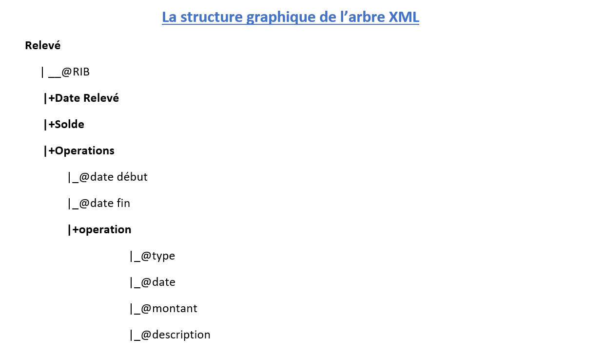
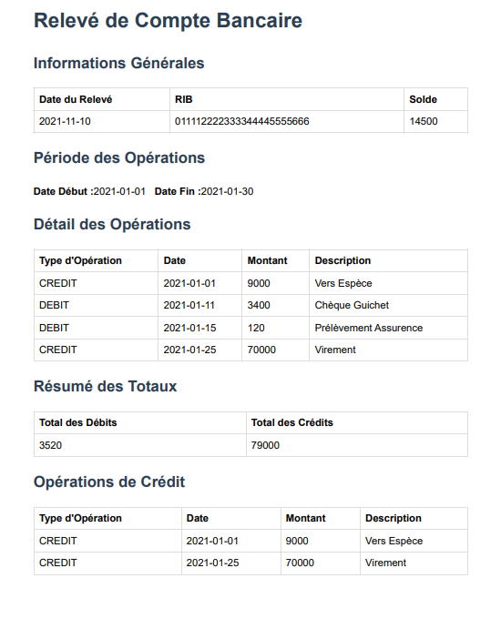
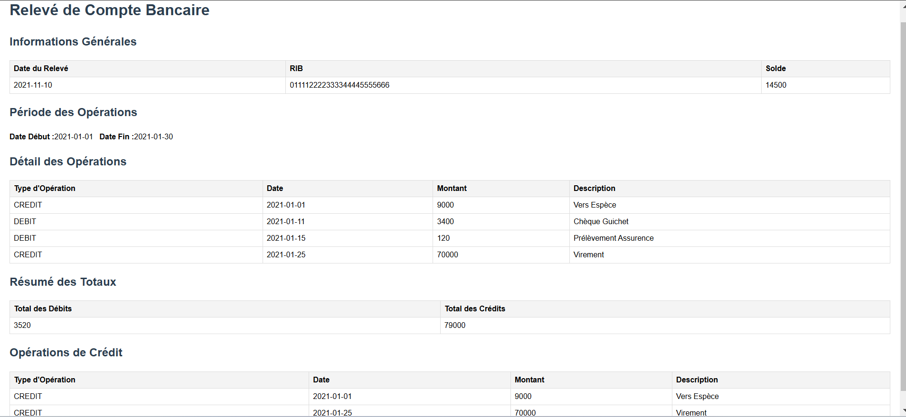

# Gestion des Relevés de Comptes Bancaires

## Table des Matières
1. [Introduction](#introduction)
2. [Format XML des Relevés](#format-XML-des-Relevés)
3. [Travail Réalisé](#Travail-réalisé)
    - [Structure Graphique de l'Arbre XML](#1.Structure-Graphique-de-l'Arbre-XML)
    - [DTD (Document Type Definition)](#2.DTD-(Document-Type-Definition))
    - [Schéma XML (XSD)](#3.Schéma-XML-(XSD))
    - [Feuille de Style XSL (Affichage Complet)](#4.Feuille-de-Style-XSL-(Affichage Complet))
4. [## Conclusion](#Conclusion)

## Introduction
Cette application a pour objectif de permettre la gestion des relevés de comptes bancaires. Les données sont stockées dans des fichiers XML conformes à une structure prédéfinie, et diverses technologies XML ont été mises en œuvre pour valider, afficher et manipuler ces données. Ce document décrit les étapes et les outils utilisés dans le projet.

## Format XML des Relevés
Les relevés de comptes bancaires sont représentés sous le format XML suivant :

```xml
<?xml version="1.0" encoding="UTF-8"?>
<releve RIB="011112222333344445555666">
    <dateReleve>2021-11-10</dateReleve>
    <solde>14500</solde>
    <operations dateDebut="2021-01-01" dateFin="2021-01-30">
        <operation type="CREDIT" date="2021-01-01" montant="9000" description="Vers Espèce"></operation>
        <operation type="DEBIT" date="2021-01-11" montant="3400" description="Chèque Guichet"></operation>
        <operation type="DEBIT" date="2021-01-15" montant="120" description="Prélèvement Assurance"></operation>
        <operation type="CREDIT" date="2021-01-25" montant="70000" description="Virement .."></operation>
    </operations>
</releve>
```

## Travail Réalisé


###1.Structure Graphique de l'Arbre XML
Un arbre XML a été élaboré pour représenter visuellement la structure du fichier XML. Cet arbre permet de mieux comprendre la hiérarchie et les relations entre les éléments tels que `releve`, `dateReleve`, `solde`, et `operations`.



###2.DTD (Document Type Definition)
Un DTD a été créé pour définir la structure du document XML et garantir sa validité. Voici un exemple de DTD :
```dtd
<?xml version="1.0" encoding="UTF-8"?>
        <!ELEMENT releve (dateReleve,solde,operations) >
        <!ELEMENT dateReleve (#PCDATA)>
        <!ELEMENT solde (#PCDATA)>
        <!ELEMENT operations (operation)*>
        <!ELEMENT operation EMPTY>


        <!ATTLIST releve RIB CDATA #REQUIRED>
        <!ATTLIST operations dateDebut CDATA #REQUIRED >
        <!ATTLIST operations dateFin CDATA #REQUIRED >
        <!ATTLIST operation type (CREDIT|DEBIT) 'DEBIT' >
        <!ATTLIST operation date CDATA #REQUIRED >
        <!ATTLIST operation montant CDATA #REQUIRED >
        <!ATTLIST operation description CDATA #REQUIRED >
```

Un fichier XML conforme à ce DTD a été créé pour tester la validité.

###3.Schéma XML (XSD)
Un schéma XML (XSD) a été élaboré pour déclarer la structure du document XML de manière plus rigoureuse et intégrer des contrôles de type. Exemple d'extrait de XSD :

```xml
<?xml version="1.0" encoding="UTF-8"?>
<xs:schema xmlns:xs="http://www.w3.org/2001/XMLSchema" elementFormDefault="qualified">
    <xs:element name="releve">
        <xs:complexType>
            <xs:sequence>
                <xs:element name="dateReleve" type="xs:date" maxOccurs="1"/>
                <xs:element name="solde" type="xs:float" maxOccurs="1"/>
                <xs:element name="operations" type="T_operations" maxOccurs="1"/>
            </xs:sequence>
            <xs:attribute name="RIB" type="xs:string" use="required"/>
        </xs:complexType>
    </xs:element>
    <xs:complexType name="T_operations">
        <xs:sequence>
            <xs:element name="operation" type="T_operation" maxOccurs="unbounded"></xs:element>
        </xs:sequence>
        <xs:attribute name="dateFin" type="xs:date" use="required"/>
        <xs:attribute name="dateDebut" type="xs:date" use="required"/>
    </xs:complexType>
    <xs:complexType name="T_operation">
        <xs:attribute name="type" use="required">
            <xs:simpleType>
                <xs:restriction base="xs:string">
                    <xs:enumeration value="CREDIT"/>
                    <xs:enumeration value="DEBIT"/>
                </xs:restriction>
            </xs:simpleType>
        </xs:attribute>
        <xs:attribute name="date" type="xs:date" use="required"/>
        <xs:attribute name="montant" type="xs:float" use="required"/>
        <xs:attribute name="description" type="xs:string" use="required"/>
    </xs:complexType>
</xs:schema>
```

#### 4.Feuille de Style XSL (Affichage Complet)
Une feuille de style XSL a été créée pour afficher toutes les données du document XML au format HTML, y compris le total des opérations de débit et de crédit.

Résultat HTML :
- Un tableau présentant les détails du relevé : date, solde, opérations.
- Une section « Totaux » pour les crédits et débits.
- Un tableau pour afficher uniquement les opérations de type "CREDIT".




html code:
```html
<html>
   <head>
      <meta http-equiv="Content-Type" content="text/html; charset=utf-8">
   
      <title>Relev&eacute; de Compte Bancaire</title><style>
                    body {
                    font-family: Arial, sans-serif;
                    margin: 20px;
                    line-height: 1.6;
                    }
                    h1, h2, h3 {
                    color: #2c3e50;
                    }
                    table {
                    width: 100%;
                    border-collapse: collapse;
                    margin-bottom: 20px;
                    }
                    th, td {
                    border: 1px solid #ddd;
                    padding: 8px;
                    text-align: left;
                    }
                    th {
                    background-color: #f4f4f4;
                    font-weight: bold;
                    }
                    p {
                    margin: 10px 0;
                    }
                </style></head>
   <body>
      <h1>Relev&eacute; de Compte Bancaire</h1>
      <h2>Informations G&eacute;n&eacute;rales</h2>
      <table>
         <tbody>
            <tr>
               <th>Date du Relev&eacute;</th>
               <th>RIB</th>
               <th>Solde</th>
            </tr>
            <tr>
               <td>2021-11-10</td>
               <td>011112222333344445555666</td>
               <td>14500</td>
            </tr>
         </tbody>
      </table>
      <h2>P&eacute;riode des Op&eacute;rations</h2>
      <p><strong>Date D&eacute;but :</strong>2021-01-01&nbsp;&nbsp;&nbsp;<strong>Date Fin :</strong>2021-01-30
      </p>
      <h2>D&eacute;tail des Op&eacute;rations</h2>
      <table>
         <thead>
            <tr>
               <th>Type d'Op&eacute;ration</th>
               <th>Date</th>
               <th>Montant</th>
               <th>Description</th>
            </tr>
         </thead>
         <tbody>
            <tr>
               <td>CREDIT</td>
               <td>2021-01-01</td>
               <td>9000</td>
               <td>Vers Esp&egrave;ce</td>
            </tr>
            <tr>
               <td>DEBIT</td>
               <td>2021-01-11</td>
               <td>3400</td>
               <td>Ch&egrave;que Guichet</td>
            </tr>
            <tr>
               <td>DEBIT</td>
               <td>2021-01-15</td>
               <td>120</td>
               <td>Pr&eacute;l&egrave;vement Assurence</td>
            </tr>
            <tr>
               <td>CREDIT</td>
               <td>2021-01-25</td>
               <td>70000</td>
               <td>Virement</td>
            </tr>
         </tbody>
      </table>
      <h2>R&eacute;sum&eacute; des Totaux</h2>
      <table>
         <thead>
            <tr>
               <th>Total des D&eacute;bits</th>
               <th>Total des Cr&eacute;dits</th>
            </tr>
         </thead>
         <tbody>
            <tr>
               <td>3520</td>
               <td>79000</td>
            </tr>
         </tbody>
      </table>
      <h2>Op&eacute;rations de Cr&eacute;dit</h2>
      <table>
         <thead>
            <tr>
               <th>Type d'Op&eacute;ration</th>
               <th>Date</th>
               <th>Montant</th>
               <th>Description</th>
            </tr>
         </thead>
         <tbody>
            <tr>
               <td>CREDIT</td>
               <td>2021-01-01</td>
               <td>9000</td>
               <td>Vers Esp&egrave;ce</td>
            </tr>
            <tr>
               <td>CREDIT</td>
               <td>2021-01-25</td>
               <td>70000</td>
               <td>Virement</td>
            </tr>
         </tbody>
      </table>
   </body>
</html>
```

## Conclusion
Ce projet met en avant l’utilisation des technologies XML pour gérer et manipuler des données structurées. Les fichiers DTD et XSD garantissent la conformité des documents, tandis que les feuilles XSL transforment ces données en présentations HTML conviviales. Ces outils forment une base solide pour le développement de l'application de gestion des relevés de comptes bancaires.

